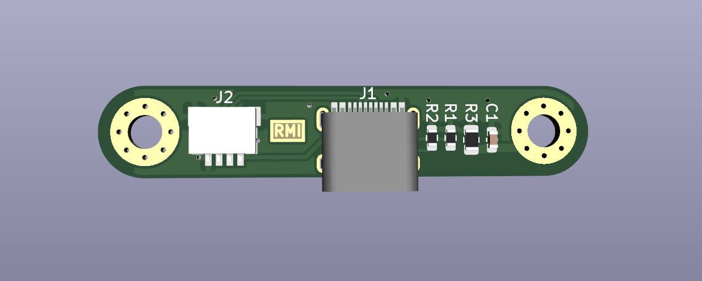

# Squatterboard V1.5

This repository is a mix between [Croktopus' squatterboard](https://github.com/Croktopus/squatterboard), [xyz's b-ken-ko daughterboard](https://github.com/xyzz/b-ken-ko/tree/main/dboard), and [my fork of the squatterboard](https://github.com/ramonimbao/squatterboard).

Calling this V2 might be confusing since [there's already a second version of it](https://github.com/Croktopus/squatterboard2), so I renamed it to V1.5.

## Features

- ai03 unified daughterboard standard
- OG Squatterboard JST and USB positioning
- b-ken-ko dboard thinness
- Compatible with my fork of the squatterboard, but can be assembled by JLCPCB.

## Ordering singles

Don't know if you can with JLCPCB. Gerbers and BOM/CPL assembly files are in `gerbers-v2`.

## Ordering panelized

Gerbers for a 2 rows × 8 cols panel are in the `panelized` folder.

Order from JLCPCB as a `Panel by Customer` but specify BOM/CPL file as for a single board. BOM/CPL assembly files located in `gerbers-v2`.
